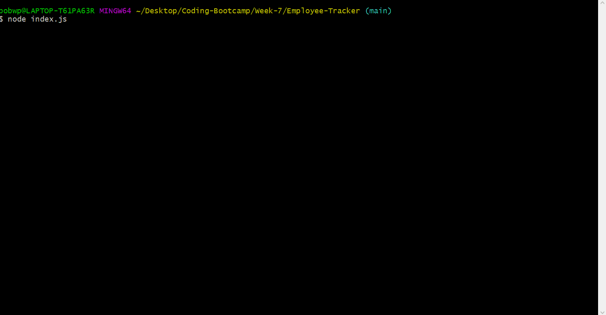

# Employee-Tracker

[](https://www.gnu.org/licenses/gpl-3.0)  


## Description

This is a command line program CMs program that allows the user to manage personnel of a company. Using an interactive series of prompts, the user can view/create/edit/delete Departments, Roles, and Employees and specify their relationships to one another. The information is stored in/retrieved from a MySQL database.




The code and all relevant files can be found at [https://github.com/perez-rob/Employee-Tracker](https://github.com/perez-rob/Employee-Tracker). 

A video demonstration of the project can be downloaded in MP4 format here: [https://github.com/perez-rob/Employee-Tracker/blob/main/demo.mp4](https://github.com/perez-rob/Employee-Tracker/blob/main/demo.mp4)

## Table of Contents

- [Installation](#installation)

- [Features](#features)

- [Usage](#usage)

- [Credits](#credits)

- [Tests](#tests)

- [Questions](#questions)

- [License](#license)  


## Installation

1) Navigate to [https://github.com/perez-rob/Employee-Tracker](https://github.com/perez-rob/Employee-Tracker)

2) Clone the repository to your local machine

3) Open your preferred CLI (Terminal, GitBash, etc.) and cd to the directory where you cloned the repo

4) Use the following command to install the required dependencies (dependency information can be found in [package.json](./package.json))
```
npm ci
```  

## Features  
This program stores and accesses company personnel information in a MySQL database and allows the user to:

- Employees
  - View all employees
  - View employees by department, role, or manager
  - Add or remove employees
  - Update employee role and/or manager

- Roles
  - View all roles
  - View roles by department
  - Add or remove roles

- Departments
  - View all departments
  - View personnel expenses by department
  - Add or remove departments


## Usage

To use this Team Profile Generator:

1) Copy the SQL code in DBschema.sql into your MySQL GUI and run to create the database and necessary tables

2) Open your preferred CLI and cd to the Employee-Tracker directory

3) Run the following command to begin the application
```
npm start
```
4) Use the up/down arrows on keyboard to navigate through options on the main menu

5) Follow the instructions presented for each action to view/create/update/delete information


## Credits

Solo project for GATech Coding Bootcamp
by Rob Perez
- [Portfolio Page](www.robperez.net)
- rob@robperez.net
- 404.317.5336


## Questions

If you have any questions about the repo, open an issue or contact me directly at rob@robperez.net. You can find more of my work at [github/perez-rob](https://github.com/perez-rob).  


## License

This project is licensed under the [GPL v3 License](https://www.gnu.org/licenses/gpl-3.0). 

